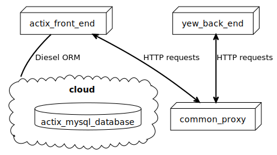

# Authentication/Authorization APP
## Back-end
Runs on [Actix Web](https://actix.rs/) framework. Compile by first setting up the database connection via **diesel setup** run the service with **cargo run**.Navigate to http://localhost:8080/.
## Storage
Cloud based MySql server. For back-end to work, docker image should be running. ORM is managed with Diesel.
## Front-end
Built with [Yew](https://yew.rs/).
Compile with **trunk serve --port 3000** Navigate to http://localhost:3000/. The application will automatically reload if you change any of the source files.
## Common
Folder contains shared files between front-end and backe-end services.
## Proxy
Front-end and back-end share a common proxy route.
